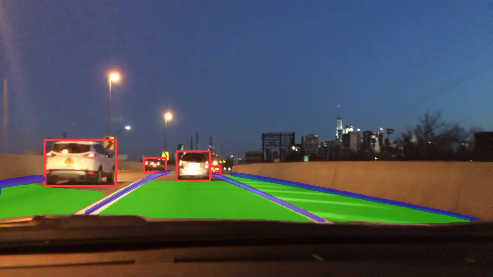
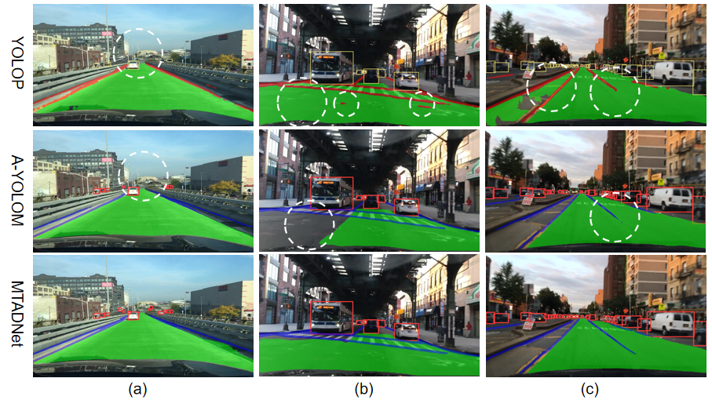
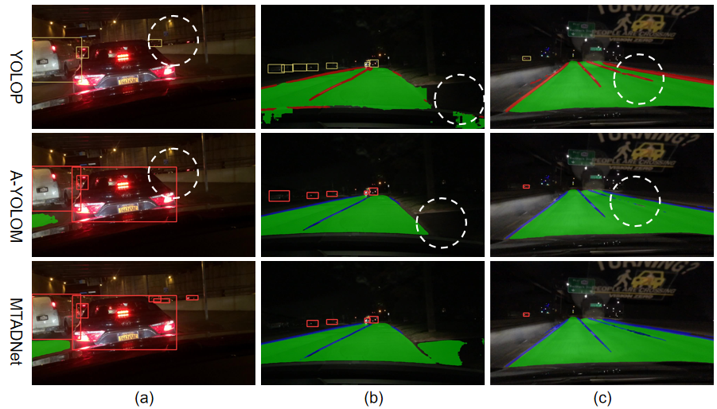

<div align="left">   


## MTFENet: A Multi-Task Autonomous Driving Network for Real-Time Target Perception
This repository(MTFENet) is the official PyTorch implementation of the paper "MTFENet: A Multi-Task Autonomous Driving Network for Real-Time Target Perception".  

---
### The Illustration of MTFENet


---

### Results

#### Evaluation of Model Size and Inference Speed.
| Networks       | Size (Pixel)| Parameters (M) | FPS(bs=32)  |
|:----------------:|:-------------:|:----------------:|:-------------:|
| YOLOP          | 640         | 7.90           | 361.27      |
| YOLOPv2        | 640         | 38.90          | 419.57      |
| YOLOPv3        | 640         | 30.2           | 389.58      |
| HybridNets     | 640         | 12.83          | 243.30      |
| A-YOLOM        | 640         | 13.61          | 346.53      |
| TriLiteNet     | 640         | **2.35**       | 423.50      |
| MTFENet        | 640         | 8.70           | **441.53**  |


#### Comparison Between Our Method and the Current SOTA on the BDD100K Validation Set.
<table style="width:80%; border-collapse:collapse; margin:auto;">
  <thead>
    <tr>
      <th rowspan="2" style="text-align:center;">Networks</th>
      <th colspan="2" style="text-align:center;">Traffic Object Detection Achievement</th>
      <th colspan="1" style="text-align:center;">Drivable Area Segmentation<br>Achievement </th>
      <th colspan="2" style="text-align:center;">Laneline Segment Achievement</th>
    </tr>
    <tr>
      <th style="text-align:center;">mAP50 (%)</th>
      <th style="text-align:center;">Recall (%)</th>
      <th style="text-align:center;">mIoU (%)</th>
      <th style="text-align:center;">Acc (%)</th>
      <th style="text-align:center;">IoU (%)</th>
    </tr>
  </thead>
  <tbody>
    <tr><td align="center">Faster R-CNN</td><td align="center">81.20</td><td align="center">64.90</td><td align="center">-</td><td align="center">-</td><td align="center">-</td></tr>
    <tr><td align="center">YOLOV5s</td><td align="center">77.20</td><td align="center">86.80</td><td align="center">-</td><td align="center">-</td><td align="center">-</td></tr>
    <tr><td align="center">MultiNet</td><td align="center">81.30</td><td align="center">60.20</td><td align="center">71.60</td><td align="center">-</td><td align="center">-</td></tr>
    <tr><td align="center">DLT-Net</td><td align="center"><b>89.40</b></td><td align="center">68.40</td><td align="center">72.10</td><td align="center">-</td><td align="center">-</td></tr>
    <tr><td align="center">PSPNet</td><td align="center">-</td><td align="center">-</td><td align="center">89.60</td><td align="center">-</td><td align="center">-</td></tr>
    <tr><td align="center">ENet</td><td align="center">-</td><td align="center">-</td><td align="center">-</td><td align="center">34.12</td><td align="center">14.64</td></tr>
    <tr><td align="center">SCNN</td><td align="center">-</td><td align="center">-</td><td align="center">-</td><td align="center">35.79</td><td align="center">15.84</td></tr>
    <tr><td align="center">ENet-SAD</td><td align="center">-</td><td align="center">-</td><td align="center">-</td><td align="center">36.56</td><td align="center">16.02</td></tr>
    <tr><td align="center">YOLOP</td><td align="center">76.50</td><td align="center">88.20</td><td align="center">90.50</td><td align="center">84.40</td><td align="center">26.50</td></tr>
    <tr><td align="center">HybridNets</td><td align="center">77.30</td><td align="center">89.70</td><td align="center">91.50</td><td align="center">85.40</td><td align="center">31.60</td></tr>
    <tr><td align="center">YOLOPv2</td><td align="center">83.40</td><td align="center">91.10</td><td align="center">93.20</td><td align="center">87.31</td><td align="center">27.25</td></tr>
    <tr><td align="center">A-YOLOM</td><td align="center">81.10</td><td align="center">86.90</td><td align="center">91.00</td><td align="center">84.90</td><td align="center">28.80</td></tr>
    <tr><td align="center">YOLOPv3</td><td align="center">84.30</td><td align="center"><b>96.90</b></td><td align="center">93.20</td><td align="center"><b>88.30</b></td><td align="center">28.00</td></tr>
    <tr><td align="center">TriLiteNet</td><td align="center">72.30</td><td align="center">85.60</td><td align="center">92.40</td><td align="center">82.30</td><td align="center">29.80</td></tr>
    <tr><td align="center"><b>MTFENet</b></td><td align="center">81.50</td><td align="center">88.40</td><td align="center"><b>93.80</b></td><td align="center">87.60</td><td align="center"><b>33.70</b></td></tr>
  </tbody>
</table>

---

### Visualization

#### video visualization Results
* Note: The raw video comes from [HybridNets](https://github.com/datvuthanh/HybridNets/tree/main/demo/video/)
* The results of our experiments are as follows:
<td></td>

####  Image Visualization Results
<table style="width:100%; text-align:center;">
  <tr>
    <td>
      <strong>Real Road</strong><br/>
      
    </td>
  </tr>
</table>

<table style="width:100%; text-align:center;">
  <tr>
    <td>
      <strong>Visual Comparison of Results on Sunny Day</strong>
      <br/>
    </td>
    <td>
      <strong>Visual Comparison of Results at Night</strong>
      <br/>
    </td>
  </tr>
  <tr>
    <td>
      <strong>Visual Comparison of Results on Rainy Day</strong>
      <br/>
    </td>
    <td>
      <strong>Visual Comparison of Results on Snow Day</strong>
      <br/>
    </td>
  </tr>
</table>


---

### Requirement
We implemented the algorithm in a Linux environment and conducted all experiments on an NVIDIA RTX 4090 GPU equipped with 24GB of memory.
The development environment was based on [Python==3.8.19](https://www.python.org/) ,[PyTorch 1.13.1](https://pytorch.org/get-started/locally/), conda 24.1.2, and CUDA11.7, with pre-training conducted on the BDD100K dataset. 

```setup
cd MTFENet
pip install -e .
```
### Dataset
- Download the images from [images](https://bdd-data.berkeley.edu/). 
- Download the annotations of detection from [detection-object-9](https://drive.google.com/file/d/1y5ypEDOtDICBrc2WLX0xMUGRlNamXLms/view?usp=sharing). 
- Download the annotations of drivable area segmentation from [seg-drivable-10](https://drive.google.com/file/d/1D4BCWfmuslXDlJIULyJ8yeGGKw3zphfd/view?usp=sharing). 
- Download the annotations of lane line segmentation from [seg-lane-11](https://drive.google.com/file/d/1h9M6gWlKbd9QQ0KEuVdoTTo8G9LKmyGS/view?usp=sharing). 

We recommend the dataset directory structure to be the following:

```
# The id represent the correspondence relation
├─dataset root
│ ├─images
│ │ ├─train2017
│ │ ├─val2017
│ ├─detection-object-9
│ │ ├─labels
│ │ │ ├─train2017
│ │ │ ├─val2017
│ ├─seg-drivable-10
│ │ ├─labels
│ │ │ ├─train2017
│ │ │ ├─val2017
│ ├─seg-lane-11
│ │ ├─labels
│ │ │ ├─train2017
│ │ │ ├─val2017
```

Update the your dataset path in the `./test_yaml/bdd-mtfenet-multi.yaml`.

### Training

```
python ./ultralytics/train.py
```
### Evaluation

```
python ./ultralytics/val.py
```
### Prediction

```
python ./ultralytics/predict.py
```

---
**Notes**: 
We would like to express our sincere appreciation to the authors of the following works for their valuable contributions to the field of multi-task visual perception. Their research has provided strong foundations and meaningful benchmarks that have significantly guided and inspired our study. We also gratefully acknowledge the open-source code repositories they provided, which facilitated fair comparison and reproducibility in our experiments:

* **MultiNet** – [Paper](https://arxiv.org/pdf/1612.07695.pdf), [Code](https://github.com/MarvinTeichmann/MultiNet)
* **DLT-Net** – [Paper](https://ieeexplore.ieee.org/abstract/document/8937825)
* **Faster R-CNN** – [Paper](https://proceedings.neurips.cc/paper/2015/file/14bfa6bb14875e45bba028a21ed38046-Paper.pdf), [Code](https://github.com/ShaoqingRen/faster_rcnn)
* **YOLOv5s** – [Code](https://github.com/ultralytics/yolov5)
* **PSPNet** – [Paper](https://openaccess.thecvf.com/content_cvpr_2017/papers/Zhao_Pyramid_Scene_Parsing_CVPR_2017_paper.pdf), [Code](https://github.com/hszhao/PSPNet)
* **ENet** – [Paper](https://arxiv.org/pdf/1606.02147.pdf), [Code](https://github.com/osmr/imgclsmob)
* **SCNN** – [Paper](https://www.aaai.org/ocs/index.php/AAAI/AAAI18/paper/download/16802/16322), [Code](https://github.com/XingangPan/SCNN)
* **ENet-SAD** – [Paper](https://openaccess.thecvf.com/content_ICCV_2019/papers/Hou_Learning_Lightweight_Lane_Detection_CNNs_by_Self_Attention_Distillation_ICCV_2019_paper.pdf), [Code](https://github.com/cardwing/Codes-for-Lane-Detection)
* **YOLOP** – [Paper](https://link.springer.com/article/10.1007/s11633-022-1339-y), [Code](https://github.com/hustvl/YOLOP)
* **HybridNets** – [Paper](https://arxiv.org/abs/2203.09035), [Code](https://github.com/datvuthanh/HybridNets)
* **YOLOv8** – [Code](https://github.com/ultralytics/ultralytics)
* **A-YOLOM** – [Paper](https://arxiv.org/pdf/2310.01641.pdf), [Code](https://github.com/JiayuanWang-JW/YOLOv8-multi-task)
* **YOLOPv3** – [Paper](https://www.mdpi.com/2072-4292/16/10/1774), [Code](https://github.com/jiaoZ7688/YOLOPv3)
* **TriLiteNet** – [Paper](https://ieeexplore.ieee.org/document/10930421), [Code](https://github.com/chequanghuy/TriLiteNet)

